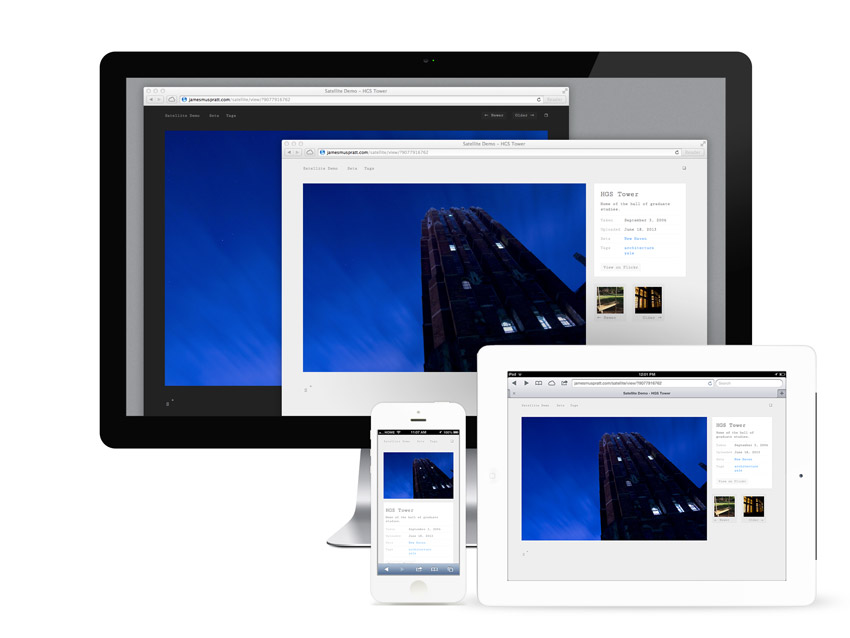

Overview
-------------
Satellite is a minimal, responsive template based on [phpFlickr](http://phpflickr.com). Use it to display your Flickr photos and sets on your own website, perhaps at `http://yourdomain.com/photos/`. Satellite uses no lightboxes, Flash code or heavy styling. Videos are served as HTML5 .mp4 files; sorry, Firefox.

Requirements
-------------

- A web server with PHP 4 or 5.
- A Flickr.com account.
- A Flickr [API Key](http://www.flickr.com/services/apps/create/apply/); presumably the non-commercial one will do.

Configuration and Setup
-----------------------

1. Duplicate config/config-template.php and rename the copy to config.php. Open it in a plain text editor and fill in your gallery title, username, API key, etc. Close and save the file.
2. Upload the contents of /satellite/ files to your web server . You can put them in a domain root or a sub-folder like `http://yourdomain.com/photos/`.
3. Set the permissions of the `cache` directory to `777`.
